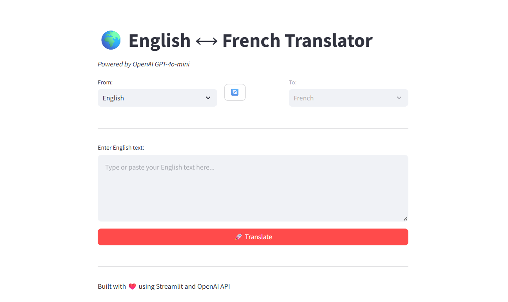
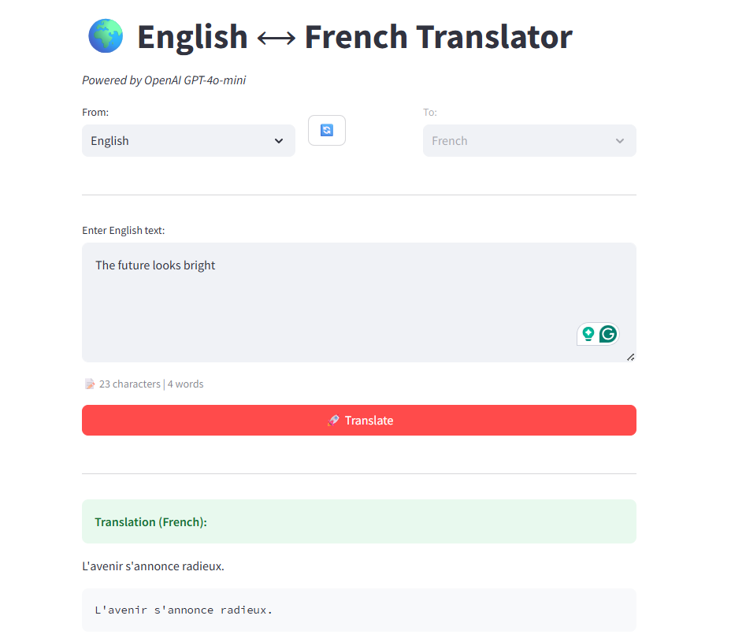
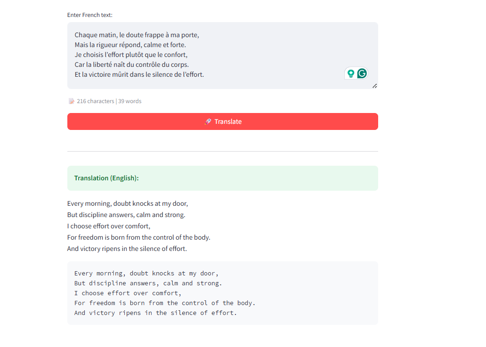

# 🌍 English-French Translator

An AI-powered bidirectional translation web application built with OpenAI's GPT-4o-mini and Streamlit.



## 🎯 Project Overview

This project demonstrates integration of modern AI APIs with web frameworks to create a practical, user-friendly translation tool. Built as a learning project to explore API integration, web development, and deployment workflows.

## ✨ Features

- 🔄 **Bidirectional Translation** - Seamlessly translate between English and French
- 🎨 **Intuitive Interface** - Clean, modern UI with Streamlit
- 📊 **Character Counter** - Real-time character and word count
- ⚡ **Fast Processing** - Powered by OpenAI's GPT-4o-mini
- 💾 **Easy Copy** - Results displayed in copy-friendly format
- 🛡️ **Error Handling** - Graceful error messages and user feedback

## 🛠️ Technologies Used

| Technology | Purpose |
|------------|---------|
| **Python 3.11** | Core programming language |
| **OpenAI API** | AI-powered translation engine |
| **Streamlit** | Web application framework |
| **python-dotenv** | Environment variable management |
| **Git/GitHub** | Version control and collaboration |

## 📸 Screenshots

### Main Interface

*Clean, intuitive interface with language selection and swap functionality*

### English to French Translation

*Real-time translation with character count: "The future looks bright" → "L'avenir s'annonce radieux."*

### French to English Translation

*Bidirectional translation demonstrating French poetry to English*

## 🚀 Installation & Setup

### Prerequisites

- Python 3.9 or higher
- OpenAI API key ([Get one here](https://platform.openai.com/api-keys))
- Git

### Step 1: Clone the Repository
```bash
git clone https://github.com/Hayou-Azizkd/English-French-translator.git
cd English-French-translator
```

### Step 2: Create Virtual Environment (Recommended)
```bash
# Windows
python -m venv .venv
.venv\Scripts\activate

# macOS/Linux
python3 -m venv .venv
source .venv/bin/activate
```

### Step 3: Install Dependencies
```bash
pip install -r requirements.txt
```

### Step 4: Set Up Environment Variables

Create a `.env` file in the project root:
```
OPENAI_API_KEY=your_api_key_here
```

⚠️ **Important:** Never commit your `.env` file to Git!

### Step 5: Run the Application
```bash
streamlit run app.py
```

The app will open in your browser at `http://localhost:8501`

## 💡 Usage

1. **Select Source Language** - Choose English or French from the dropdown
2. **Enter Text** - Type or paste text to translate in the text area
3. **Click Translate** - Press the 🚀 Translate button
4. **View Results** - Translation appears below with character count
5. **Swap Languages** - Click the 🔄 button to reverse translation direction
6. **Copy Result** - Use the code block for easy copying

## 📁 Project Structure
```
English-French-translator/
│
├── app.py                 # Streamlit web interface
├── translator.py          # Core translation logic with OpenAI
├── requirements.txt       # Python dependencies
├── .env                   # API keys (not tracked by Git)
├── .gitignore            # Files to exclude from Git
├── README.md             # Project documentation
├── LICENSE               # MIT License
└── .venv/                # Virtual environment (not tracked)
```

## 🔐 Security & Best Practices

- ✅ API keys stored in `.env` (gitignored)
- ✅ Virtual environment for dependency isolation
- ✅ Spending limits set on OpenAI account
- ✅ Error handling for API failures
- ✅ Input validation and user feedback

## 💰 Cost Considerations

Using OpenAI's GPT-4o-mini model:
- **~$0.0001 per translation** (very affordable!)
- **$5 credit ≈ 50,000 translations**
- Set spending limits in OpenAI dashboard for safety

## 📚 What I Learned

This project helped me develop skills in:

- ✅ **API Integration** - Working with OpenAI's REST API
- ✅ **Web Development** - Building interactive UIs with Streamlit
- ✅ **Environment Management** - Using virtual environments and .env files
- ✅ **Git Workflow** - Version control, commits, and GitHub
- ✅ **Error Handling** - Debugging and fixing runtime issues
- ✅ **Problem Solving** - Troubleshooting package conflicts and API errors
- ✅ **Documentation** - Writing clear README and code comments

## 🚧 Challenges Faced

1. **OpenAI Version Conflicts** - Resolved by upgrading to latest version (2.6.1)
2. **Streamlit Session State** - Fixed widget state management bugs
3. **API Key Management** - Implemented secure environment variables
4. **Virtual Environment Setup** - Learned proper Python environment isolation

## 🔮 Future Enhancements

- [ ] Add more language pairs (Spanish, German, Italian, etc.)
- [ ] Implement translation history
- [ ] Add text-to-speech for pronunciation
- [ ] Support file upload for batch translation
- [ ] Deploy to Streamlit Cloud for public access
- [ ] Add user authentication
- [ ] Implement caching for repeated translations
- [ ] Add dark mode toggle
- [ ] Create mobile-responsive design
- [ ] Add language detection feature

## 🤝 Contributing

This is a learning project, but suggestions and improvements are welcome!

1. Fork the repository
2. Create a feature branch (`git checkout -b feature/AmazingFeature`)
3. Commit your changes (`git commit -m 'Add some AmazingFeature'`)
4. Push to the branch (`git push origin feature/AmazingFeature`)
5. Open a Pull Request

## 📝 License

This project is licensed under the MIT License - see the [LICENSE](LICENSE) file for details.

## 🙏 Acknowledgments

- **OpenAI** for providing the GPT-4o-mini API
- **Streamlit** for the amazing web framework
- **DeepLearning.AI** for inspiration and learning resources
- **Python Community** for excellent documentation

## 👤 Author

**Hayou Abdoul Aziz**

- GitHub: [@Hayou-Azizkd](https://github.com/Hayou-Azizkd)
- LinkedIn: [Hayou Abdoul Aziz](https://www.linkedin.com/in/hayou-abdoul-aziz-847540188/)
- Email: abdoulhayou34@gmail.com

---

⭐ **If you found this project helpful, please consider giving it a star!**

*Built with ❤️ as a learning project - October 2025*